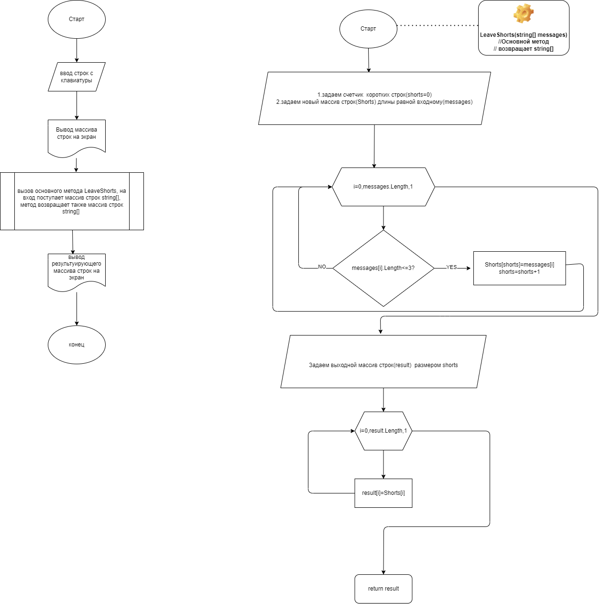

# Итоговая контрольная работа
## 1. Создать репозиторий на Github
*Имя репозитория*:6.Final-Work.git    
*Ссылка на репозиторий:* https://github.com/Pavel-P-Malyshev/6.Final-Work.git


## 2.Нарисовать блок-схему алгоритма
Получившеяся блок-схема доступна в самом репозитории в виде интегрированного файла DRAWIO.      
Но ее также можно посмотреть **здесь**: 




## 3.Снабдить репозиторий оформленным текстовым описанием (readme.md)
*Вы читаете его в данный момент*


## 4.Написать программу, решающую поставленную задачу.
Программа написана на языке **С#**                  
Основной метод программы представлен ниже
```
string[] LeaveShorts(string[] messages)
{
    
    int shorts=0;
    string[] Shorts=new string[messages.Length];

    for (int i = 0; i < messages.Length; i++)
    {
        if (messages[i].Length<=3)
        {
            Shorts[shorts]=messages[i];
            shorts++;
        }
    }
    
    string[] result=new string [shorts];
    for (int i = 0; i < result.Length; i++)
    {
        result[i]=Shorts[i];
    }

    return result;

}

````
Результат работы программы:
```
Введите строки через запятую:
system,:),123,33333
Ваш массив строк:
[ "system", ":)", "123",  "33333"]
Получившийся массив строк с длиной не более 3 символов:
[ ":)",  "123"]
```

## 5.Использовать контроль версий, разные этапы должны быть в разных коммитах
